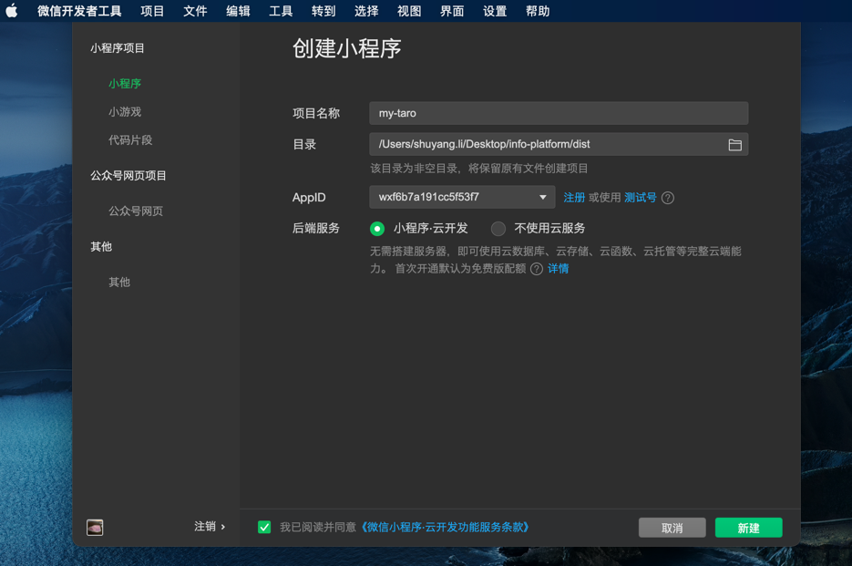

## info-platform

### 相关信息

本项目为校园活动中心的用户端。

接口设计文档：https://www.notion.so/thisssydenotion/infoPlatform-P1-daba143e9e1b462eacacfcc4bccdf69d

### 具体配置

- APPID：
  - 目前是使用的我的旧项目的，需要更换，即负责人申请一个新的微信小程序获得APPID，配置微信小程序的相关属性
  - 部分本地配置，在project.config.json文件中，记得更换appid
- baseUrl
  - 后端域名，目前使用的mock域名，在微信开发者工具中调试时需在本地设置中勾选"不校验合法域名"
  - 因为微信对服务器的安全性要求很高，所以后端提供的IP或URL需在相应微信小程序的主页进行备案处理
  - 本地配置，在src/base/servers/baseUrl.ts中设置

### 环境与开发工具支持

- nodejs
- vue
- taro
- 微信开发者工具
- WebStorm

### 代码运行

1. `npm install` 安装项目相关依赖
2. `npm run dev` 将taro项目打包成weapp项目（命令定义在package.json文件）
3. 微信开发者工具打开dist文件（打包后的weapp项目）

   
4. 使用微信开发者工具进行编译调试
